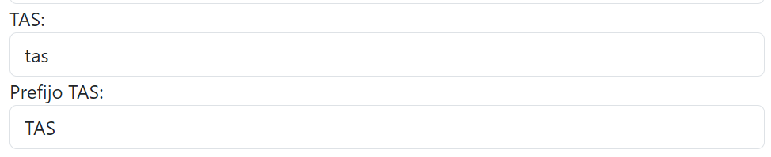

# Ticket Generator

## Remedy Folder:

#### Description

Automation ticketing


#### BRAINSTORMING

- Al copiar el nombre del ticket se ponga automaticamente si es TAS, WO, etc y que se estructure el fichero a descargar adecuadamente
- 

  
- Al usar ya Bootstrap, algo visual bonito sin perder funcionalidad que es lo que buscamos, no digo colores, sino espaciado, etc.
- Ponemos menú? qué contendría este?


## CLONING REPO
```
git clone https://github.com/GCCT-Systems/Remedy_Ticket_Folder_Generator.git .
```
### Deploying
```
git add .

git commit -m 'commentsForCommit'

git push origin master
```


# LICENSE

MIT License

[PREVISUALIZACION-WEB](https://gcct-systems.github.io/Remedy_Ticket_Folder_Generator/)
